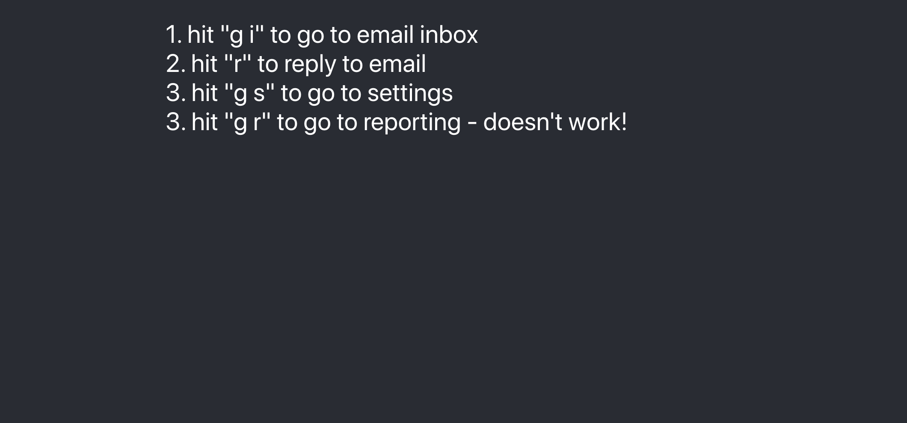

# Bug

This repository contains a very simple app that reproduces a bug. Our objective is to discover and
fix the bug!

You can use any tools you'd like to debug this. `console.log`, debuggers, Google—any of that is fair
game.

## Running the App

This is a simple `create-react-app`, and can be run in the usual way:

```sh
npm install
npm start
```

## Getting Started

Once `npm start` is run, the development server will open the page. By default this will be at
`localhost:3000`.

Once the page is open, you should see clear instructions for how to reproduce the bug:


